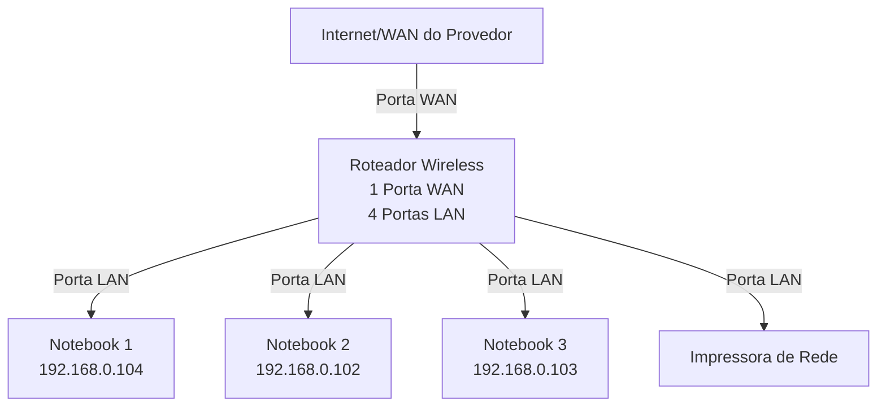
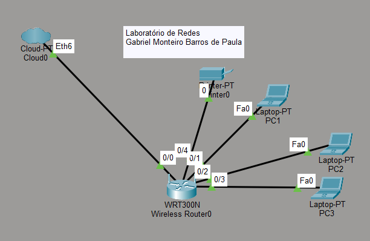

# Laboratório de redes do Senac

Todas (ou quase todas) as minhas experiências nas aulas de redes do Senac. Documentadas e registradas neste repositório do github.

---

## 01. Objetivo

- Montagem e configuração de uma rede de porte doméstico, usando 3 (três) laptops e uma impressora, todos conectados via um modem à Internet

1. Montagem e configuração da rede de maneira virtual/teórica usando o Cisco Packet Tracer, simulando a rede real
2. Implementação da rede no laboratório real

---

## 02. Equipamentos utilizados

- 3 (três) laptops
- 1 (um) modem wireless com 1 (uma) porta WAN e 4 (quatro) portas LAN
- 1 (uma) impressora de rede

---

## 03. Topologia da Rede

Diagrama lógico da rede usada neste laboratório.

---

Imagem da topologia usada neste laboratório:

---
